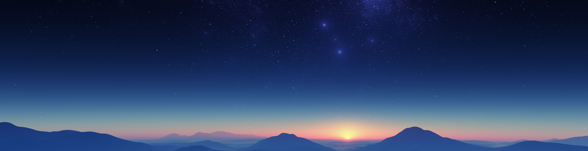

 

  

###

  
  
  

###

<h1 align="center">😉 Sobre mim! 😉</h1>

###

  👋🏾 Olá, Sou Igor Cristhofer. Atualmente estudo Análise e Desenvolvimento de Sistemas e faço cursos extras de desenvolvedor Front-End.
   
   🎓 Cursando Análise e Desenvolvimento de Sistemas (<strong>FATECIE</strong>).
   🌱 Atualmente aprimorando conhecimentos em React, TypeScript e Tailwind CSS.
   ✍️ Nas horas vagas, gosto de escrever contos e explorar mundos em jogos de sobrevivência e sandbox.

###

<h2 align="center">💻 Técnologias 💻</h2>

###

  &nbsp;
   &nbsp; &nbsp;
  
  
   
  
  
  
  
  
  
  

###

 

  
  

###
